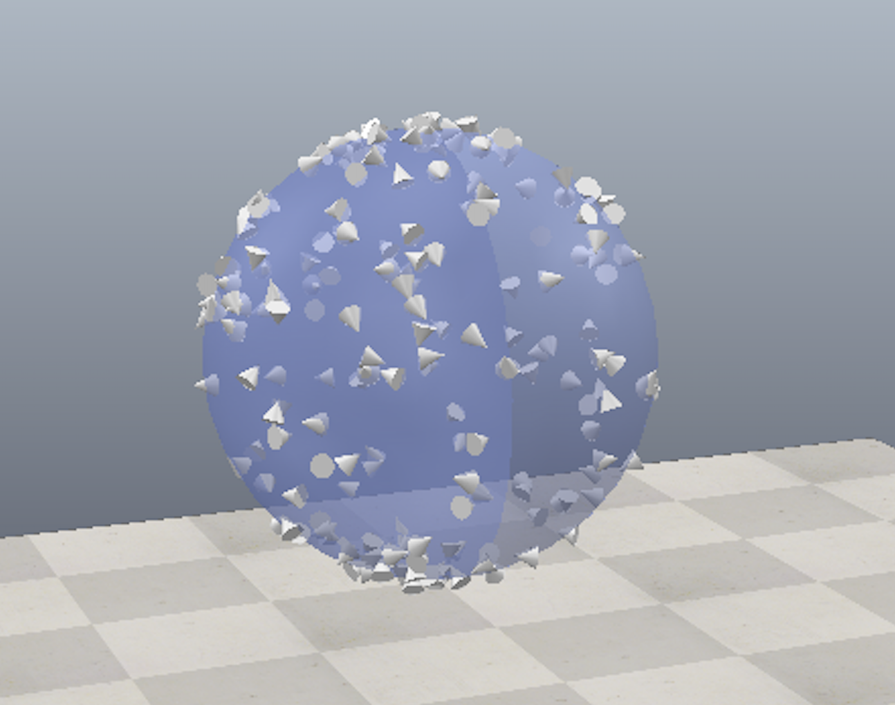

# 3D Spatial Sampling Strategies 

---

## Project Objectives
Generate uniformly random samples (cones) with random orientation on the surface of unit sphere as follows:


---

## Motivations
Random sampling is a crucial technique in various fields, including robotics and path planning. In many problems, the dimensionality of the configuration space results in combinatorial explosion, making it difficult to find optimal solutions. Random sampling may provide a near-optimal or good enough solution faster and more efficiently than an exhaustive search.

In 3D space, orientation exploration is represented by a sphere. The random orientation of a cone represents a second degree of orientation consideration, i.e., the orientation of both parent and child objects. The distribution of random samples may vary for each problem domain, such as uniform, Gaussian, or power-law. In this instance, we need to ensure the random sample is uniform across the action space to obtain a representative sample of the space. Therefore, generating uniformly random samples on the surface of a unit sphere with random orientation is an effective approach to efficiently explore orientation space.

---

## Approach
To ensure a uniform distribution of points on the surface of a unit sphere, we can use techniques such as Marsaglia's method, Cook's method, or UV method. Marsaglia's method involves selecting random points in 3D space and rejecting points that fall outside the sphere. Cook's method involves generating random points in 4D space and projecting them onto the surface of the sphere. UV method involves generating random points in a 2D UV space and mapping them to the surface of the sphere.

Once we have generated a uniform random point on the sphere, the next step is to select a random orientation of the cone. This can be done by generating three random Euler angles for rotation. The Euler angles determine the orientation of the cone with respect to the x, y, and z-axes. By randomly selecting these angles, we can generate a random orientation of the cone. 

---

## Key Features
- Uniform selection of random points on the surface of a sphere (rotation from surface)
- Uniform random orientation of a cone (rotation from origin)
- Implement in CoppeliaSim with Python
- Implement in Matplotlib with Python
- Implement as Web Application with JavaScript 
- Visualization of point density using a heatmap to illustrate uniform distrubtion.

---

## Algorithmic Overview:

### 3D Space-fixed rotation: Uniform Random Points on Sphere Surface

To generate a uniformly random point on the surface of a unit sphere, the Marsaglia method is commonly used. This method involves:

1. Generating two random numbers uniformly between `-1` and `1`.
2. Checking if the point (x1, x2) falls within the unit circle: `x1^2 + x2^2 < 1`.
3. If the point falls within the circle, computing the coordinates of the point based on the Marsaglia method:

```
   x = 2 * x1 * sqrt(1 - x1^2 - x2^2)
   y = 2 * x2 * sqrt(1 - x1^2 - x2^2)
   z = 1 - 2 * (x1^2 + x2^2)
```
   
This approach ensures a uniform distribution of points across the surface of the sphere. 


### 3D Body-fixed rotation: Uniform Random Orientations

To define an orientation, three independent Euler angles are used to represent the rotation on the x-axis, y-axis, and z-axis. To ensure a uniform random orientation, each angle is sampled uniformly from the range of 0 to 2π radians. By doing so, every possible orientation on the surface of the sphere has an equal probability of being selected, guaranteeing a uniform distribution of orientations. 


---

## Implementation in CoppeliaSim 

---

## Implementation in Python
[![Demo: Python]](./assets/py-sphere-sample.gif)

---

## Implementation in JavaScript
[](https://scalemailted.github.io/Basic-Motion-Planning/WebApp/)

---

## Project Hierarchy 
- assets
    + contains all images in readme documentation
- coppeliaSim
    + scenes
        - contains coppeliasim scenes (.tt)
    + python
        - contains associated python scripts from scene
- python
    + contains code for standalone python app
- javaScript
    + contains code for standalone javascript app